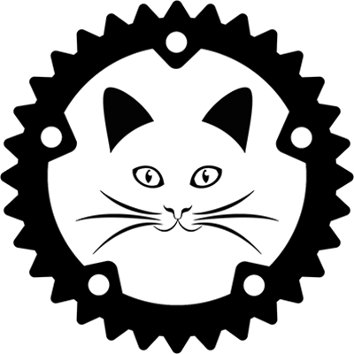

# Cat Engine

A 2D graphics engine with audio support.

Uses OpenGL 2.0 and above.

#### Dependencies
 - Graphics - [glium](https://github.com/glium/glium)
 - Images - [image](https://github.com/image-rs/image)
 - Fonts - [rusttype](https://gitlab.redox-os.org/redox-os/rusttype)
 - Music - [cpal](https://github.com/RustAudio/cpal)

If you use audio feature alsa delevopment libraries are required for Linux: `libasound2-dev` for Debian and Ubuntu, `alsa-lib-devel` for Fedora (check [cpal](https://github.com/RustAudio/cpal)).

## Features

Default features = ["texture_graphics","simple_graphics","text_graphics"]

Other features = ["audio","mouse_cursor_icon"]

### Mouse cursor icon

Replaces default mouse cursor with users one.

It uses image to draw the cursor.

The cursor points to the center of cursor image.

Path to the image is `./resources/images/mouse_icon.png`.